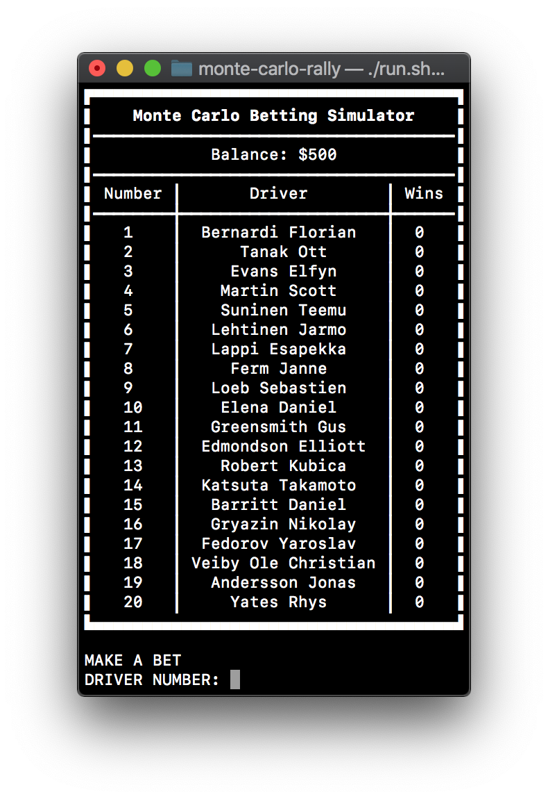

# Monte Carlo Betting Simulator





Description of the project is available [here](https://github.com/bartekjacak/EOOP20L-project/blob/master/doc/final.md).

Build and run the project using CLion or with the following command:
```sh
$ ./build.sh && ./run.sh
```

Run tests with this command:
```sh
$ ./test.sh
```
