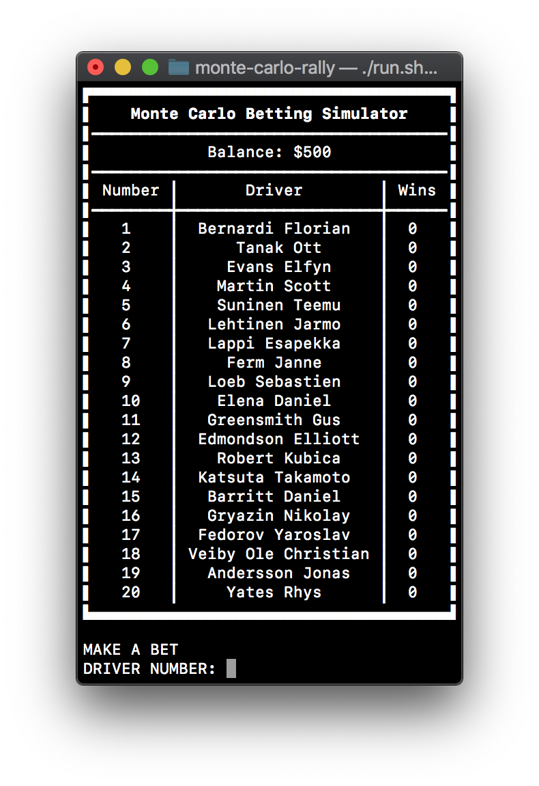
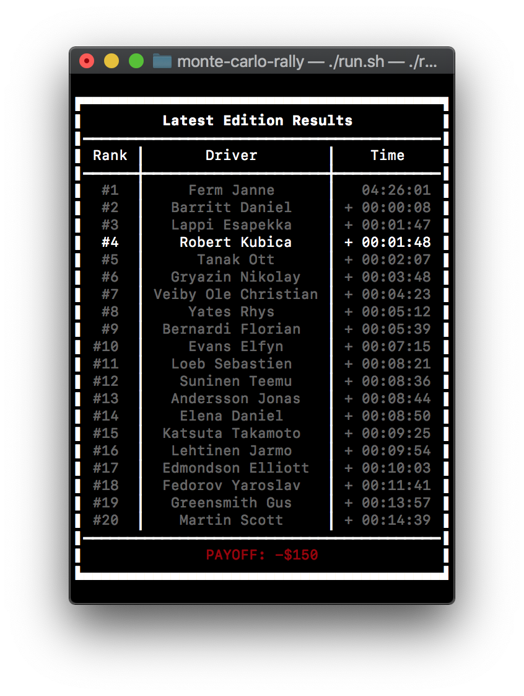
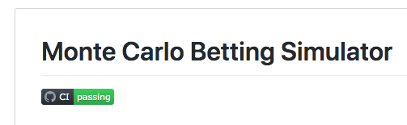
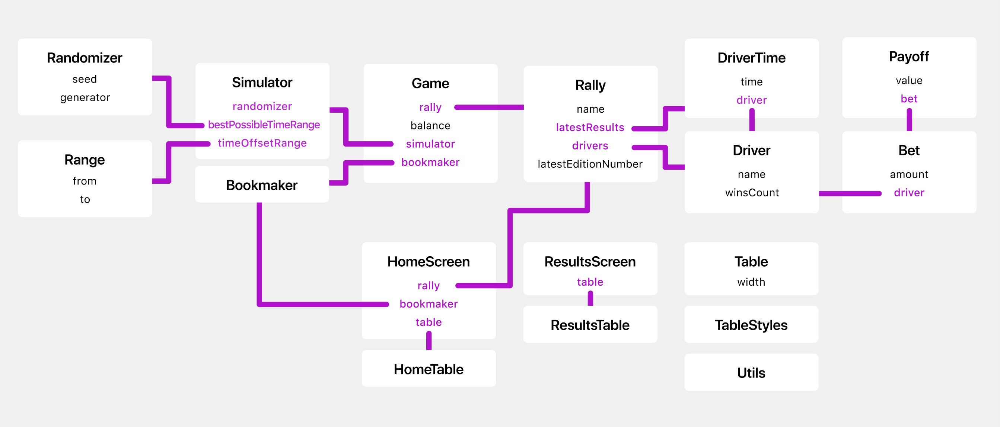

# Description
The goal of the project was to create a simple **Monte Carlo Rally betting simulator**, accessible via basic console user interface.
Player can provide his bet amount and a driver from a list and then, dependning on the position of the selected driver,
the better will either lose or win some money. The game has no ending nor a way to save the progress and the list of drivers doesn't change.

## What's new?

Development of the project led to clarification of the user interface. Now, it consists of two screens in an infinite loop.


\

First one – home screen, displays player's current balance (bounded by the range of an integer) and the list of drivers. Player can make a bet by providing number of a driver and bet amount.


\

After that, the results screen is showed, containing a table with drivers' results and player's payoff (positive or negative depending on the position of the selected driver).
Next, after pressing ENTER main screen is displayed and the loop starts from beginning.


\

Project is tested on Linux, macOS and it should work on Windows. Application can be built using CLion or `build.sh` script.
For the building purposes I used CMake with the following compiler flags: `-Wall -Wextra -Wpedantic -Werror -pedantic-errors -fsanitize=undefined`.
`run.sh` script can be used to run the project. For the tests I used `googletest` library and they can be run using `test.sh` file. Project is available as a
public [GitHub repository](https://github.com/bartekjacak/EOOP20L-project), where I used GitHub Actions for automated building and testing.

File structure consists of four directories:

* `/` – scripts, CMakeLists.txt and README
* `/src` - source and header files + CMakeLists.txt
* `/tests` - tests' source files + CMakeLists.txt
* `/third-party` - third party libraries: `googletest` and `libfort`
* `/doc` – project documentation

# Memory map


\

# Class declarations

Only public interfaces and private data structures.

## What's new?

Some new UI-related classes were added to the project. I also got rid of the whole `RallyEdition` class and added `Payoff` to store payoff with an original bet.

**Game**

Class responsible for the whole "game loop". It holds a reference to the `Rally`, `Bookmaker`, `Simulator` and keeps track of the user balance. It no longer
holds current `Bet` object as it wasn't necessary.

```c++
class Game {
public:
    Game(Utils::Randomizer randomizer, Rally& _rally, const Bookmaker& bookmaker, int balance);
    void start();

private:
    Rally& _rally;
    const Bookmaker& _bookmaker;

    // Account balance of the player
    int _balance;

    Simulator _simulator;
};
```

**Bookmaker**

Can create a `Bet` struct and is responsible for paying the bets off. Methods didn't change their names,
but their arguments and return types are a bit different than it was planned.

If betted driver won, the payoff is equal to betted amount of money multiplied by the possibility of winning.
Otherwise player looses all the betted money.

```c++
class Bookmaker {
public:
    // Create new bet
    [[nodiscard]] Bet makeBet(int amount, const Driver& driver) const;
    // Get the payoff
    [[nodiscard]] Payoff getPayoff(const Bet& bet, const Rally& rally) const;
};
```

**Rally**

It became a mix of previously planned `Rally` and `RallyEdition` classes. The class holds rally
name, drivers, latest edition results and the numbe of latest edition.

```c++
class Rally {
public:
    const std::string& name;
    const std::vector<Driver>& drivers;
    std::vector<DriverTime> latestResults;
    int latestEditionNumber;

    class InvalidDriverIdError: public std::exception {};

    Rally(const std::string& name_, const std::vector<Driver>& drivers_);

    [[nodiscard]] std::vector<int> getSortedResultsIndices() const;

    [[nodiscard]] const Driver& getDriver(unsigned long index) const;

    // Performs a simulation using simulator
    void perform(Simulator simulator);
};
```

**Simulator**

Provides a method to simulate results of provided drivers. Can be configured by setting
`_bestPossibleTimeRange` and `_timeOffsetRange`. It is a very simplified simulation:
First, it uses random distribution with weights (where drivers' winsCounts are treated as weights)
to select the winner and randomizes his result from `_bestPossibleTimeRange`. The positions of remaining
drivers are fully random, based on their randomized time offset from `_timeOffsetRange`.

```c++
typedef std::chrono::duration<int> duration;
typedef Utils::Range<duration> durationRange;

class Simulator {
  public:
    explicit Simulator(Utils::Randomizer randomizer);

    // Simulates drivers' performance on a single edition
    [[nodiscard]] std::vector<DriverTime> simulateResults(const std::vector<Driver>& drivers);

  private:
    Utils::Randomizer _randomizer;
    durationRange _bestPossibleTimeRange;
    durationRange _timeOffsetRange;
};
```

**Driver**

Holds driver's name and mutable winsCount, which wasn't initially planned, but it's used for the simulation purposes.

```c++
class Driver {
public:
    std::string name;
    mutable int winsCount;

    explicit Driver(std::string name_, int winsCount_ = 0);

    // Overloading the comparison operator
    friend bool operator==(const Driver& lhs, const Driver& rhs);
};
```

**DriverTime**

Keeps a reference `Driver` and his `time` measured in seconds. Usage of `chrono` library is
the biggest improvement here. I also got rid of unused overloads of comparison operators.

```c++
class DriverTime {
public:
    const Driver& driver;

    DriverTime(const Driver& driver_, std::chrono::duration<int> time);
    [[nodiscard]] int getTime() const;

    // Overloading the comparison operator
    friend bool operator<(const DriverTime& lhs, const DriverTime& rhs);

private:
    std::chrono::duration<int> _time;
};
```

**Bet**

Structure holding information about bet, no changes here.

```c++
struct Bet {
	const unsigned int amount;
    const Driver &driver;

	Bet(unsigned int amount_, const Driver &driver_);
};
```

**Payoff**

New structure used for keeping information about payoff.

```c++
struct Payoff {
    int value;
    const Bet& bet;

    Payoff(int value_, const Bet& bet_): value(value_), bet(bet_) {};
};
```

**Range**

New structure used to define ranges.

```c++
template<typename T>
struct Range {
    T from;
    T to;
    Range(T from_, T to_): from(from_), to(to_) {};
};
```

**Randomizer**

New class used to generate random value within a given range. Can be seeded to obtain predictable results.

```c++
class Randomizer {
public:
    explicit Randomizer(unsigned long long int seed_ = 0);
    [[nodiscard]] int randomIn(Range<int> range);
private:
    unsigned long long int seed;
    std::mt19937_64 generator;
};
```

## UI-related classes

New classes used for displaying user interface. All held in `UI` namespace.
Tables are rendered using `libfort` C++ library.

**HomeScreen**

Class used to display home screen.

```c++
class HomeScreen {
public:
    HomeScreen(const Rally& rally, int balance, const Bookmaker& bookmaker);
    Bet display() const;

private:
    const Rally& _rally;
    const Bookmaker& _bookmaker;
    HomeTable _table;
};
```

**ResultsScreen**

Class used to display results home screen.

```c++
class ResultsScreen {
public:
    ResultsScreen(const Rally& rally, const Payoff& payoff);
    void display() const;

private:
    ResultsTable _table;
};
```

**Table**

Wrapper for `libfort` table class.

```c++
class Table: public fort::char_table {
public:
    explicit Table(size_t width_);

    template<typename T, typename ...Ts>
    void addHeader(
        const TableStyles& styles,
        const T &str,
        const Ts &...strings
    );

    template<typename T, typename ...Ts>
    void addRow(
        const TableStyles& styles,
        const T &str,
        const Ts &...strings
    );

    template<typename T, typename ...Ts>
    void addFullSizeHeader(
        const TableStyles& styles,
        const T &str,
        const Ts &...strings
    );

    void centerColumn(size_t id);
    void print() const;
private:
    const size_t width;
};
```

**TableStyles**

Helper class used to pass styles to table cells.

```c++
class TableStyles {
public:
    typedef fort::text_style Appearance;
    Appearance appearance;

    typedef fort::text_align Alignment;
    Alignment alignment;

    typedef fort::color Color;
    Color textColor;
    Color backgroundColor;

    explicit TableStyles(Alignment alignment_);
    explicit TableStyles(Color textColor, Color backgroundColor_ = Color::black);
    explicit TableStyles(
        Appearance appearance_ = Appearance::default_style,
        Alignment _alignment_ = Alignment::left,
        Color textColor = Color::default_color,
        Color backgroundColor_ = Color::black
    );
};
```

**HomeTable**

Styled and formatted table for the home screen.

```c++
class HomeTable : public Table {
public:
    HomeTable(const Rally& rally, int balance);
};
```

**ResultsTable**

Styled and formatted table for the results screen.

```c++
class ResultsTable: public Table {
public:
    ResultsTable(const Rally& rally, const Payoff& payoff);
};
```

**Utils**

```c++
class Utils {
public:
    // Request input from user with a message
    template<typename T>
    static T request(const std::string& message);

    // Clear the screen
    static void clear();

    // Pause the screen until some key is pressed
    static void pause();

    // Format integer as a string with appropriate number of leading zeros
    static std::string toStringWithLeadingZeros(int value, int length);

    // Format time: HH:MM:SS
    static std::string formatTime(int time);

    // Format time with respect to a second one: +HH:MM:SS
    static std::string formatTime(int time, int reference);
};
```

# Tests
Tests were written using `googletest` library. Only methods that are part of public
classes' interfaces were tested.

**Driver**
```c++
using namespace std::chrono_literals;

class DriverTests : public ::testing::Test {
protected:
    DriverTests(): nameA("Mike Scott"), driverA(nameA) {}

    std::string nameA;
    Driver driverA;
};

TEST_F (DriverTests, operators) {
    EXPECT_TRUE(driverA == driverA);
}
```

**DriverTime**
```c++
using namespace std::chrono_literals;

class DriverTimeTests : public ::testing::Test {
protected:
    DriverTimeTests():
        driverA("Mike Scott"),
        driverB("Robert Kubica"),
        resultA(driverA, 100s),
        resultB(driverB, 200s) {}

    Driver driverA;
    Driver driverB;
    DriverTime resultA;
    DriverTime resultB;
};

TEST_F (DriverTimeTests, operators) {
    EXPECT_TRUE(resultA < resultB);
}

TEST_F (DriverTimeTests, getTime) {
    auto resultA = DriverTime(driverA, 1990s);

    EXPECT_EQ(resultA.getTime(), 1990);
}
```

**Simulator**

```c++
using namespace std::chrono_literals;

class SimulatorTests : public ::testing::Test {
protected:
    SimulatorTests():
        nameA("Mike Scott"),
        nameB("Robert Kubica"),
        nameC("Diego Asan"),
        drivers({Driver(nameA), Driver(nameB), Driver(nameC)}) {}

    std::string nameA;
    std::string nameB;
    std::string nameC;
    std::vector<Driver> drivers;
};

TEST_F (SimulatorTests, simulateResults) {
    auto seed = 1;
    auto randomizer = Utils::Randomizer(seed);
    auto simulator = Simulator(randomizer);

    auto results = simulator.simulateResults(drivers);
    std::vector<DriverTime> expectedResults = {
        DriverTime(drivers[0], std::chrono::duration<int>(1)),
        DriverTime(drivers[1], std::chrono::duration<int>(2)),
        DriverTime(drivers[2], std::chrono::duration<int>(3))
    };

    auto timesSum = results[0].getTime() + results[1].getTime() + results[2].getTime();

    EXPECT_EQ(results[0].driver, expectedResults[0].driver);
    EXPECT_EQ(results[1].driver, expectedResults[1].driver);
    EXPECT_EQ(results[2].driver, expectedResults[2].driver);
    EXPECT_TRUE(timesSum > 0);
}
```

**Bookmaker**

```c++
using namespace std::chrono_literals;

class BookmakerTests : public ::testing::Test {
protected:
    BookmakerTests():
        bookmaker(),
        betAmount(100),
        nameA("Mike Scott"),
        nameB("Robert Kubica"),
        driverA(nameA),
        driverB(nameB),
        resultA(driverA, 100s),
        resultB(driverB, 200s) {}

    Bookmaker bookmaker;
    int betAmount;
    std::string nameA;
    std::string nameB;
    Driver driverA;
    Driver driverB;
    DriverTime resultA;
    DriverTime resultB;
};

TEST_F (BookmakerTests, makeBet) {
    auto bet = bookmaker.makeBet(betAmount, driverA);

    EXPECT_TRUE(bet.amount == betAmount);
    EXPECT_TRUE(bet.driver.name == driverA.name);
}

TEST_F (BookmakerTests, getPayoff_WhenWinning) {
    std::vector<Driver> drivers = { driverA, driverB };
    auto rally = Rally("A", drivers);
    rally.latestResults.push_back(resultA);
    rally.latestResults.push_back(resultB);

    auto bet = bookmaker.makeBet(betAmount, driverA);
    auto payoff = bookmaker.getPayoff(bet, rally);

    EXPECT_TRUE(payoff.value >= betAmount);
}

TEST_F (BookmakerTests, getPayoff_WhenLosing) {
    std::vector<Driver> drivers = { driverA, driverB };
    auto rally = Rally("A", drivers);
    rally.latestResults.push_back(resultA);
    rally.latestResults.push_back(resultB);

    auto bet = bookmaker.makeBet(betAmount, driverB);
    auto payoff = bookmaker.getPayoff(bet, rally);

    EXPECT_TRUE(payoff.value == -betAmount);
}
```

**Rally**

```c++

using namespace std::chrono_literals;

class RallyTests : public ::testing::Test {
protected:
    RallyTests():
        nameA("Mike Scott"),
        nameB("Robert Kubica"),
        nameC("Diego Asan"),
        drivers({Driver(nameA), Driver(nameB), Driver(nameC)}),
        rally("A", drivers)
    {
        rally.latestResults.push_back({drivers[0], 100s});
        rally.latestResults.push_back({drivers[1], 200s});
        rally.latestResults.push_back({drivers[2], 50s});
    }

    std::string nameA;
    std::string nameB;
    std::string nameC;
    std::vector<Driver> drivers;
    Rally rally;
};

TEST_F (RallyTests, getSortedResultsIndices) {
    auto sortedResults = rally.getSortedResultsIndices();
    std::vector<int> expectedResults = { 2, 0, 1 };

    EXPECT_EQ(sortedResults, expectedResults);
}

TEST_F (RallyTests, getDriver_withValidId) {
    auto index = 1;
    auto driver = rally.getDriver(index);

    EXPECT_EQ(driver.name, drivers[index - 1].name);
}

TEST_F (RallyTests, getDriver_withInvalidId) {
    try {
        auto driver = rally.getDriver(4);
        FAIL() << "Expected some error " << driver.name;
    } catch(Rally::InvalidDriverIdError const &_) {
        EXPECT_TRUE(1);
    } catch(...) {
        FAIL() << "Expected Rally::InvalidDriverIdError ";
    }
}

TEST_F (RallyTests, perform) {
    auto seed = 1;
    auto randomizer = Utils::Randomizer(seed);
    auto simulator = Simulator(randomizer);
    rally.perform(simulator);

    EXPECT_EQ(rally.latestEditionNumber, 1);
}
```
