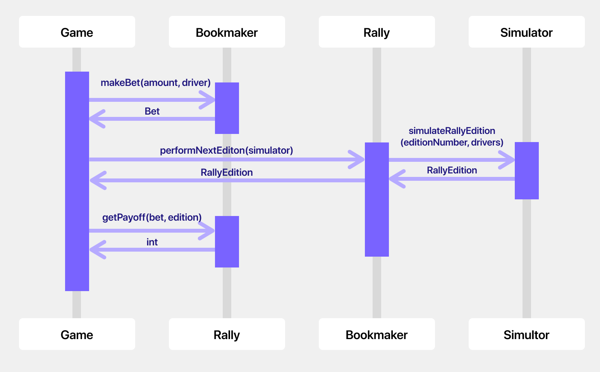
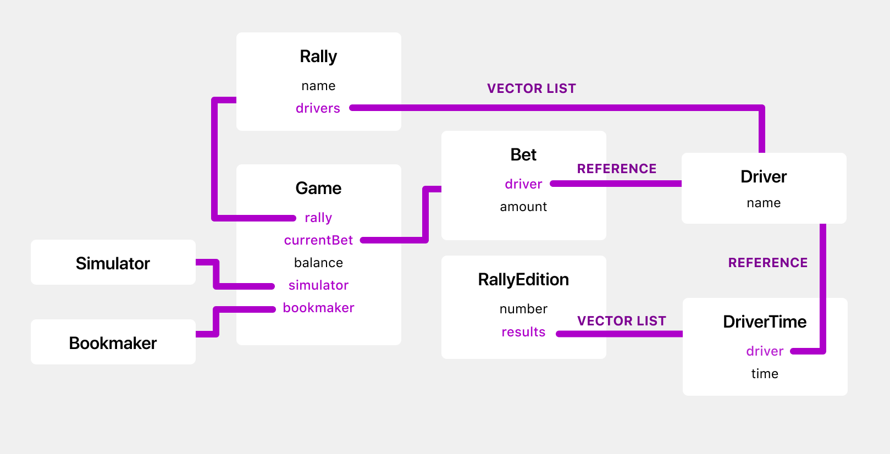

# Description
The goal of the project is to create a simple **Monte Carlo Rally betting simulator**. It will be accessible via simple console user interface.
Player (the better) will be able to select his bet amount and a driver from a list. The list of drivers will remain the same whole time. Then,
dependning on the position of the selected driver, better will either lose or win some money. The game has no ending, and no way to save the progress.

A diagarm of a single player "turn" (making a bet and receiving the pay off from performed edition) is presented below:


\

## Classes

**Game**

Class responsible for displaying game UI. It holds a reference to the `Rally`, `Bookmaker`, `Simulator` and current `Bet` object. It also keeps a track of the user balance.

**Bookmaker**

Can create a `Bet` struct and is responsible for paying the bets off (depending on the `RallyEdition` results and the `Bet` amount).

**Rally**

Have a rally `name`, `drivers` list and is responsible for creates `RallyEdition` objects using the simulator.

**RallyEdition**

Holds _unique_ edition number and `results` which is a list of `DriverTime` objects.

**DriverTime**

Keeps a reference `Driver` and his `time` measured in seconds.

**Simulator**

Performs a simulation and returns `RallyEdition` object.

**Driver**

Holds driver's name.

## Structs

**Bet**

It holds a bet `amount` and a `Driver` reference.


# Memory map

\

# Class declarations
Public interface and private data structures only.

**Game**

```c++
class Game {
  public:
    Game(Rally rally, Simulator simulator, Bookmaker bookmaker);
    ~Game();
    // Starts the game
    void start();

  private:
    Rally _rally;
    Simulator _simulator;
    Bookmaker _bookmaker;

    // Account balance of the player
    unsigned int _balance;

    // Bet exists only when user creates it
    // and is deleted immediately after getting the payoff
    std::optional<Bet> _currentBet;
};
```

**Bookmaker**

```c++
class Bookmaker {
  public:
    Bookmaker();

    // Creates a new bet
    Bet makeBet(unsigned int amount, Driver driver) const;

    // Return the payoff
    unsigned int getPayoff(Bet bet, RallyEdition edition) const;
};
```

**Rally**

```c++
class Rally {
  public:
    Rally(std::string name, std::vector<Driver> drivers);
    ~Rally();

    // Performs a simulation using simulator and returns finished edition
    RallyEdition performNextEditon(Simulator simulator) const;
  private:
    std::string _name;
    std::vector<Driver> _drivers;
};
```

**Simulator**

```c++
class Simulator {
  public:
    Simulator();

    // Simulates drivers' performance on a single edition
    RallyEdition simulateRallyEdition(unsigned int editionNumber, std::vector<Driver> drivers);
};
```

**RallyEdition**

```c++
class RallyEdition {
  public:
    RallyEdition(unsigned int number, std::vector<DriverTime> results);
    ~RallyEdition();

    // Returns drivers' times in ascending order
    std::vector<DriverTime> getOrderedResults() const;
  private:
    // Unique edition number
    unsigned int _number;

    // Drivers' times used to calculate each player's place on the scoreboard
    std::vector<DriverTime> _results;
};
```

**Driver**

```c++
class Driver {
  public:
  	Driver(std::string name_);
    ~Driver();

    // Overloading the comparison operators
    friend bool operator==(const Driver& lhs, const Driver& rhs);
    friend bool operator!=(const Driver& lhs, const Driver& rhs);

  private:
	  const std::string name;
};
```

**DriverTime**

```c++
class DriverTime {
  public:
    DriverTime(const Driver &driver, float time);
    ~DriverTime();

    // Overloading the comparison operators
    friend bool operator==(const DriverTime& lhs, const DriverTime& rhs);
    friend bool operator!=(const DriverTime& lhs, const DriverTime& rhs);
    friend bool operator>(const DriverTime& lhs, const DriverTime& rhs);
    friend bool operator>=(const DriverTime& lhs, const DriverTime& rhs);
    friend bool operator<(const DriverTime& lhs, const DriverTime& rhs);
    friend bool operator<=(const DriverTime& lhs, const DriverTime& rhs);

  private:
    const &Driver _driver;
    // Time in seconds
    float _time;
};
```

**Bet**

```c++
struct Bet {
	const unsigned int amount;
  const Driver &driver;

	Bet(unsigned int amount_, const Driver &driver_);
};
```

# Tests
Tests will be written only for methods, that are a part of public classes' interfaces.
Below, I presented some cases which could be tested with the expected result.

**Driver**
```c++
  Driver a("John Doe");
  Driver b("Jane Kowalsky");
  Driver c("John Doe");

  // Checking overloaded comparison operators
  a == a // true
  a == b // false
  a == c // true
  a != b // true
```

**DriverTime**
```c++
  Driver driverA("John Doe");
  Driver driverB("Jane Kowalsky");
  Driver driverC("James White");
  DriverTime a(driverA, 10.1);
  DriverTime b(driverB, 9.81);
  DriverTime c(driverC, 10.1);

  // Checking overloaded comparison operators
  a == a // true
  a == b // false
  a == c // true
  a != b // true

  a > b // true
  a > c // false
  a < b // false
  a < c // false

  a >= a // true
  a <= a // true

  a >= b // true
  a >= c // true
  a <= b // false
  a <= c // true
```

**Rally edition**
```c++
  Driver driverA("John Doe");
  Driver driverB("Jane Kowalsky");
  Driver driverC("James White");
  DriverTime a(a, 10.1);
  DriverTime b(b, 11.81);
  DriverTime c(c, 9.9);

  RallyEdition firstEdition(1, {a, b, c});

  // Check if results are returned in a correct order
  firstEdition.getOrderedResults(); // { c, a, b }
```

**Simulator**

```c++
  Driver a("John Doe");
  Driver b("Jane Kowalsky");
  Driver c("James White");
  Simulator simulator();

  RallyEdition firstEdition = simulator.simulateRallyEdition(1, {a, b, c});

  // Check if edition contains 3 driver times
  firstEdition._results.size() == 3; // true

  // Chech if each returned driver's time is not a NULL
  firstEdition._results.at(0)._time != NULL; // true
  firstEdition._results.at(1)._time != NULL; // true
  firstEdition._results.at(2)._time != NULL; // true

  // We also shouldn't allow the simulation without drivers
  RallyEdition secondEdition = simulator.simulateRallyEdition(2, {}); // error
```


**Bookmaker**

```c++
  Driver a("John Doe");
  Driver b("Jane Kowalsky");
  Bookmaker bookmaker();

  // Check returned bet
  bet = bookmaker.makeBet(10, a);
  bet.amount == 10; // true
  bet.driver == a; // true

  // Check returned payoff for two cases:
  Driver driverA("John Doe");
  Driver driverB("Jane Kowalsky");
  DriverTime a(a, 10.1);
  DriverTime b(b, 11.8);
  RallyEdition firstEdition(1, {a, b});

  // 1. Payoff from bet on a winner should be greater than 0
  firstBet = bookmaker.makeBet(100, a);
  bookmaker.getPayoff(firstBet, firstEdition) > 0; // true

  // 2. Payoff from bet on a looser should be smaller than 0
  secondBet = bookmaker.makeBet(100, b);
  bookmaker.getPayoff(secondBet, firstEdition) < 0; // true
```

**Rally**

```c++
  // In order to test if #performNextEdition(Simulator simulator)
  // calls the proper simulator method we can mock the Simulator class:
  class MockSimulator: Simulator {
    public:
      bool wasSimulateRallyEditionCalled = false;

      RallyEdition simulateRallyEdition(unsigned int editionNumber, std::vector<Driver> drivers) {
        wasSimulateRallyEditionCalled = true;
      }
  }

  MockSimulator simulator();
  Driver a("John Doe");
  Rally rally("Monte Carlo", { a });
  rally.performNextEditon(simulator);

  simulator.wasSimulateRallyEditionCalled; // true
```
